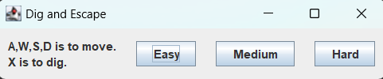
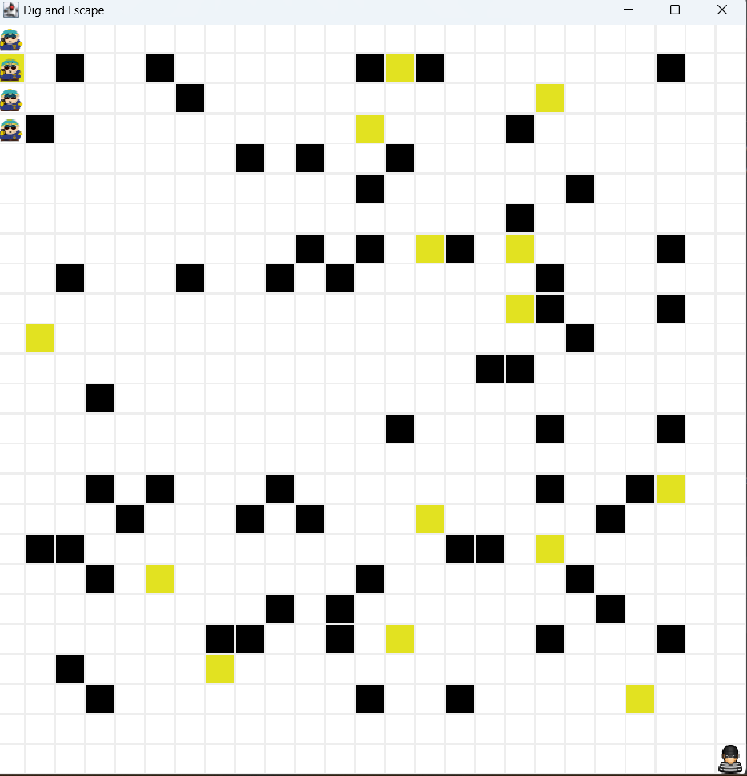

# Dig-and-Escape
The Cops are after you! You just made you great escape from prison. Armed with your shovel you must dig up the right escape tile before the cops catch you. 

# How to play
A, W, S, D is how to move

X is to dig 

# Start Panel Screenshot

# Gameplay
The gold tiles are your diggable tiles. One of them conatins the escape square. The black tiles are rocks. You can use these to help you get away.
Based on the game mode you select tells you the type of cop that is after you. 
Their are three different types of cops chasing you. 
1. Chaser - This cop is dedicated to his work and will constanly try to move closer to you after every move you make.
2. Intermediate - This cop has been on the force for a decent amount of time but lost their spunk. They move closer to you every other move
3. Random - This is the rookie cop who does not know what he is doing. Some might say he doesn't even have his police radio on! They move in random directions everytime you move

# Gameplay Screenshot

